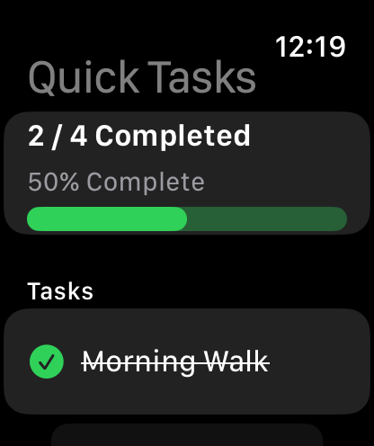
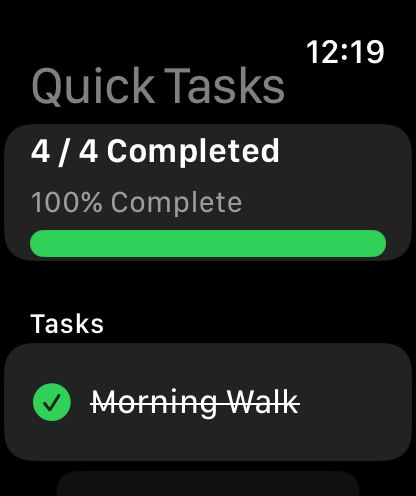
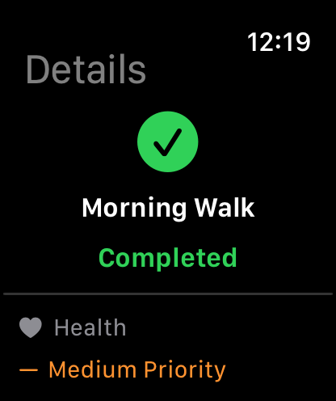

# SE4041 – Mobile Application Design & Development  
## Practical 05 – Building a watchOS App with SwiftUI

**Module:** SE4041 – Mobile Application Design & Development  
**Platform:** watchOS  
**Development Environment:** Xcode  
**Framework:** SwiftUI  
**Language:** Swift

---

## 1. Practical Overview

In the previous practical, you created an iOS application using SwiftUI.

In this practical, you will use the same Swift and SwiftUI knowledge to build an application for **Apple Watch**.

Apple Watch applications are designed for short and focused interactions. Users normally look at the watch for a small amount of time, perform a quick action, and continue with what they were doing. Apple therefore recommends keeping watchOS interactions concise and providing important information at a glance.

During this practical, you will learn how to:

- create a watchOS project in Xcode,
- run the application using the Apple Watch Simulator,
- create watchOS interfaces using SwiftUI,
- use `VStack`, `HStack`, `Text`, `Image`, and `Button`,
- manage data using `@State`,
- accept simple user input,
- display a list,
- navigate between watch screens,
- design an interface suitable for the smaller Apple Watch display.

---

## 2. Learning Objectives

By the end of this practical, you should be able to:

1. Create a watchOS application using Xcode.
2. Run a watchOS application using the Apple Watch Simulator.
3. Explain the basic structure of a watchOS SwiftUI application.
4. Create an interface suitable for an Apple Watch screen.
5. Use SF Symbols in a watchOS interface.
6. Use `@State` to manage changing values.
7. Respond to button interaction.
8. Display collections using `List`.
9. Use `NavigationStack` and `NavigationLink`.
10. Build a simple multi-screen watchOS application.

Apple recommends SwiftUI for modern watchOS app interfaces and supports managing the watch app lifecycle through a type conforming to `App`.

---

## 3. Exercise 0 – Create the watchOS Project

Use a Mac with Xcode and a watchOS Simulator runtime installed. This practical assumes basic Swift and SwiftUI knowledge. Use a watchOS 9 or later deployment target for `NavigationStack`; the `#Preview` example requires Xcode 15 or later.

Open **Xcode**.

Choose:

**File → New → Project**

Select:

**watchOS → App**

Click **Next**.

Use:

```text
Product Name: QuickTasks
Interface: SwiftUI
Language: Swift
```

Choose:

**Watch-only App**

for this practical. Template labels may vary by Xcode version; choose the option that creates a watchOS app without an iOS companion. If Interface or Language fields are not shown, use the SwiftUI/Swift defaults.

A Watch-only app runs independently on Apple Watch and does not require an accompanying iPhone application.

Save the project inside your GitHub repository.

---

## 4. Select the Apple Watch Simulator

At the top of Xcode, open the device selector.

Choose an available Apple Watch Simulator.

For example:

```text
Apple Watch Series
Apple Watch Ultra
```

The exact simulator models available depend on the version of Xcode installed.

If no watch simulator is listed, install the watchOS runtime from **Xcode → Settings → Components** (called **Platforms** in some versions), then add a simulator through **Window → Devices and Simulators**. Select the watch app scheme and an Apple Watch run destination.

Press:

```text
Command + R
```

to run the application.

The Apple Watch Simulator should open.

---

## 5. Understanding the watchOS Application

Open the main application file.

It should contain code similar to:

```swift
import SwiftUI

@main
struct QuickTasks_Watch_App: App {

    var body: some Scene {

        WindowGroup {
            ContentView()
        }
    }
}
```

The structure should look familiar from your iOS SwiftUI application.

```swift
@main
```

marks the application's starting point.

```swift
App
```

is the SwiftUI application protocol.

```swift
WindowGroup
```

contains the application's initial view.

```swift
ContentView()
```

is the first interface displayed.

Apple documents the same `App` and `WindowGroup` lifecycle pattern for watchOS apps.

---

## 6. Exercise 01 – Your First Watch Interface

Open:

```text
ContentView.swift
```

Replace the existing interface with the following. In later exercises, keep `import SwiftUI` at the top of this file and replace the previous `ContentView` rather than adding a second definition. Keep only one `@main` app entry point in the target.


```swift
import SwiftUI

struct ContentView: View {

    var body: some View {

        VStack(spacing: 8) {

            Image(systemName: "applewatch")
                .font(.title)

            Text("SE4041")
                .font(.headline)
                .bold()

            Text("watchOS")
                .font(.caption)
        }
    }
}

#Preview {
    ContentView()
}
```

Run the application.

You should see a compact layout on the Apple Watch Simulator.

---

## 7. Designing for a Small Screen

An Apple Watch display is much smaller than an iPhone display.

Therefore, avoid placing too much information on one screen.

Instead of:

```text
Long paragraphs
Large forms
Many buttons
Large navigation menus
```

prefer:

```text
Short text
Important information
One or two primary actions
Simple lists
Quick interactions
```

Apple describes watchOS experiences as brief interactions where important information should be available quickly and actions should require only a few taps.

---

## 8. Exercise 02 – Simple Layout

Replace the previous interface with:

```swift
struct ContentView: View {

    var body: some View {

        VStack(spacing: 10) {

            Image(systemName: "figure.walk")
                .font(.largeTitle)
                .foregroundStyle(.green)

            Text("Daily Activity")
                .font(.headline)

            Text("5,240")
                .font(.title)
                .bold()

            Text("Steps")
                .font(.caption)
                .foregroundStyle(.secondary)
        }
    }
}
```

Run the app.

Observe how the layout fits the watch display.

---

## 9. Exercise 03 – `@State` and Button Interaction

Create a simple water-tracking application.

Replace `ContentView` with:

```swift
struct ContentView: View {

    @State private var glasses = 0

    var body: some View {

        VStack(spacing: 10) {

            Image(systemName: "drop.fill")
                .font(.largeTitle)
                .foregroundStyle(.blue)

            Text("Water")
                .font(.headline)

            Text("\(glasses)")
                .font(.largeTitle)
                .bold()

            Text("Glasses")
                .font(.caption)

            Button("Add") {
                glasses += 1
            }
        }
    }
}
```

Run the application.

Tap:

```text
Add
```

several times.

The displayed value should update automatically. `@State` stores a value owned by this view; changing it causes SwiftUI to update the affected interface. It does not save data between app launches.

---

## 10. Add a Reset Button

Add another button:

```swift
Button("Reset") {
    glasses = 0
}
```

Your interface may now contain:

```swift
VStack {

    Text("\(glasses)")

    Button("Add") {
        glasses += 1
    }

    Button("Reset") {
        glasses = 0
    }
}
```

Test both buttons.

---

## 11. Exercise 04 – Improve the Controls

Use SF Symbols inside buttons.

Replace the Add button with:

```swift
Button {
    glasses += 1
} label: {

    Label(
        "Add Water",
        systemImage: "plus.circle.fill"
    )
}
```

You may also use:

```swift
Button {
    glasses = 0
} label: {

    Label(
        "Reset",
        systemImage: "arrow.counterclockwise"
    )
}
```

This makes the interface easier to understand at a glance.

---

## 12. Exercise 05 – Create a Model

Create a new Swift file:

```text
TaskItem.swift
```

Add:

```swift
import Foundation

struct TaskItem: Identifiable {

    let id = UUID()

    var title: String
    var completed: Bool
}
```

This model represents a small task. `Identifiable` gives each task a stable identity through `id`. Ensure the new file belongs to your watch app target.

---

## 13. Create Sample Tasks

Return to:

```text
ContentView.swift
```

Add:

```swift
@State private var tasks = [

    TaskItem(
        title: "Morning Walk",
        completed: true
    ),

    TaskItem(
        title: "Drink Water",
        completed: false
    ),

    TaskItem(
        title: "Read Notes",
        completed: false
    )
]
```

---

## 14. Exercise 06 – Display a List

Replace the main interface with:

```swift
struct ContentView: View {

    @State private var tasks = [

        TaskItem(
            title: "Morning Walk",
            completed: true
        ),

        TaskItem(
            title: "Drink Water",
            completed: false
        ),

        TaskItem(
            title: "Read Notes",
            completed: false
        )
    ]

    var body: some View {

        List(tasks) { task in

            HStack {

                Image(
                    systemName:
                        task.completed
                        ? "checkmark.circle.fill"
                        : "circle"
                )

                Text(task.title)
            }
        }
    }
}
```

Run the application.

The tasks should appear as a scrollable watchOS list.

SwiftUI's `List` is well suited to watchOS and provides richer functionality than older WatchKit table interfaces.

---

## 15. Exercise 07 – Navigation

Now add navigation.

Wrap the list using:

```swift
NavigationStack {
```

and:

```swift
}
```

Then create a new SwiftUI file:

```text
TaskDetailView.swift
```

Add:

```swift
import SwiftUI

struct TaskDetailView: View {

    let task: TaskItem

    var body: some View {

        VStack(spacing: 10) {

            Image(
                systemName:
                    task.completed
                    ? "checkmark.circle.fill"
                    : "circle"
            )
            .font(.largeTitle)

            Text(task.title)
                .font(.headline)
                .multilineTextAlignment(.center)

            Text(
                task.completed
                ? "Completed"
                : "Pending"
            )
            .font(.caption)
        }
    }
}
```

---

## 16. Add a NavigationLink

Modify the list:

```swift
NavigationStack {

    List(tasks) { task in

        NavigationLink {

            TaskDetailView(task: task)

        } label: {

            HStack {

                Image(
                    systemName:
                        task.completed
                        ? "checkmark.circle.fill"
                        : "circle"
                )

                Text(task.title)
            }
        }
    }
    .navigationTitle("Tasks")
}
```

Run the application.

Tap one of the tasks.

The detail screen should open.

---

## 17. Exercise 08 – Toggle Task Status

We now want users to mark a task as completed.

Because the items are stored inside an array, one easy beginner-friendly approach is to work with the array index.

For this exercise, replace the navigation rows with buttons. This demonstrates toggling separately; the final task must provide both toggling and access to details.

Change the list to:

```swift
List(tasks.indices, id: \.self) { index in

    Button {

        tasks[index].completed.toggle()

    } label: {

        HStack {

            Image(
                systemName:
                    tasks[index].completed
                    ? "checkmark.circle.fill"
                    : "circle"
            )

            Text(tasks[index].title)

            Spacer()
        }
    }
}
```

Run the app.

Tap a task.

The icon should change between:

```text
○
```

and:

```text
✓
```

---

## 18. Display a Completion Count

Inside `body`, before the main layout, calculate:

```swift
let completedCount =
    tasks.filter { $0.completed }.count
```

A simple interface could be:

```swift
VStack {

    Text(
        "\(completedCount)/\(tasks.count) Completed"
    )
    .font(.caption)

    List(tasks.indices, id: \.self) { index in

        Button {

            tasks[index].completed.toggle()

        } label: {

            HStack {

                Image(
                    systemName:
                        tasks[index].completed
                        ? "checkmark.circle.fill"
                        : "circle"
                )

                Text(tasks[index].title)
            }
        }
    }
}
```

The count should update automatically. Alternatively, place this computed property inside `ContentView`, outside `body`, and use it in the layout:

```swift
private var completedCount: Int {
    tasks.filter { $0.completed }.count
}
```

---

## 19. Knowledge Check

Before attempting the final task, make sure you can answer:

1. What is a Watch-only app?
2. What does `@main` represent?
3. What does `WindowGroup` do?
4. Why should watchOS screens contain less information than iPhone screens?
5. What does `@State` do?
6. Why can SwiftUI automatically update the interface?
7. What is an SF Symbol?
8. What does `Identifiable` provide?
9. Why is `List` useful on Apple Watch?
10. What does `NavigationStack` do?
11. What does `NavigationLink` do?
12. What does `.toggle()` do?
13. What does `filter` do in the completion-count example?

---

## 20. Final Practical Task – Quick Tasks Watch App

Create a watchOS application called:

```text
Quick Tasks
```

The application will allow the user to quickly view and complete daily tasks directly from the Apple Watch.

---

### Part A – Task Model

Create:

```swift
struct TaskItem: Identifiable
```

with:

```text
id
title
completed
```

---

### Part B – Initial Tasks

Your application must begin with at least **four tasks**.

Example:

```text
Morning Walk
Drink Water
Read Notes
Call Home
```

Use:

```swift
@State
```

to store the tasks.

---

### Part C – Main Screen

The main screen should contain:

```text
Quick Tasks

2 / 4 Completed

✓ Morning Walk
○ Drink Water
○ Read Notes
✓ Call Home
```

Use:

- `NavigationStack`
- `VStack`
- `List`
- SF Symbols

---

### Part D – Complete a Task

When the user taps a task, its status should change.

Use:

```swift
.toggle()
```

to change:

```text
false → true
```

or:

```text
true → false
```

The icon should change automatically.

Suggested symbols:

```swift
circle
checkmark.circle.fill
```

---

### Part E – Completion Count

At the top of the interface, display:

```text
2 / 4 Completed
```

Use:

```swift
filter
```

to calculate the completed tasks.

---

### Part F – Task Detail Screen

Create a separate:

```text
TaskDetailView
```

Provide separate, clearly labelled interactions: a task-row button to toggle completion and a `NavigationLink` to open details, for example on a separate “Details” row. Avoid placing a button inside a navigation link. Keep the list inside `NavigationStack`.

The screen should display:

- task title,
- task status,
- suitable SF Symbol.

For example:

```text
Morning Walk

✓

Completed
```

---

### Part G – Add One Additional Feature

Choose **one** of the following:

**Option A – Reset Tasks**

Add a button that marks every task as incomplete.

**Option B – Progress Percentage**

Display:

```text
50% Complete
```

based on the number of completed tasks.

**Option C – Task Categories**

Add a category to each task, for example:

```text
Health
Study
Personal
```

Display it on the detail screen.

**Option D – Priority**

Add:

```text
High
Medium
Low
```

using an enum.

Display the priority on the detail view.

---

## 21. Expected Application Flow

The main screen may look similar to:

```text
--------------------
     Quick Tasks

   2 / 4 Completed

✓ Morning Walk

○ Drink Water

○ Read Notes

✓ Call Home
--------------------
```

Selecting a task may display:

```text
--------------------

       ✓

   Morning Walk

     Completed

--------------------
```

Your design does not have to match this exactly.

The important goal is to create an interface that is simple and appropriate for quick Apple Watch interaction.

---

## 22. Testing

Test the following before submission.

### Test 1

Launch the application.

Confirm that all tasks appear.

### Test 2

Tap an incomplete task.

Confirm that it becomes completed.

### Test 3

Tap the same task again.

Confirm that it returns to incomplete.

### Test 4

Complete several tasks.

Confirm that the completion count changes.

### Test 5

Open the detail screen.

Confirm that the correct task information appears. Return to the main screen, change that task’s status, and reopen its details to verify the updated status.

### Test 6

Test using at least two available Apple Watch Simulator sizes if available.

Because Apple Watch models vary in screen dimensions, layouts should remain compact and adaptable.

---

## 23. Screenshots

Create:

```text
screenshots/
```

Add at least:

```text
01-Main-Screen.png
02-Completed-Tasks.png
03-Task-Detail.png
```

The screenshots must show the application running in the Apple Watch Simulator. Use **File → Save Screen** in Simulator (or its screenshot command), then save the images with the filenames above.

After adding the files, you can embed them in your repository README:

```markdown



```

---

## 24. Suggested Repository Structure

```text
SE4041-Practical-WatchOS/
│
├── QuickTasks.xcodeproj/
│   └── project.pbxproj
│
├── QuickTasks/
│   ├── QuickTasksApp.swift
│   ├── ContentView.swift
│   ├── TaskItem.swift
│   ├── TaskDetailView.swift
│   └── Assets.xcassets
│
├── screenshots/
│   ├── 01-Main-Screen.png
│   ├── 02-Completed-Tasks.png
│   └── 03-Task-Detail.png
│
└── README.md
```

The exact project structure may differ depending on the Xcode version.

---

## 25. Submission Requirements

Your submission should include:

- complete Xcode watchOS project,
- `TaskItem` model,
- SwiftUI interface,
- `@State`,
- SF Symbols,
- `List`,
- task status change,
- completion count,
- navigation,
- task detail screen,
- one additional feature,
- screenshots,
- GitHub repository.

---

## 26. GitHub Submission

Run these commands from your repository folder. They assume the repository already has a GitHub remote and an upstream branch configured. Review `git status` before committing; include the Xcode project and source files, and exclude generated build folders such as `DerivedData/` and personal `xcuserdata/` files.

Before submitting:

```bash
git status
git add .
git commit -m "Complete SE4041 watchOS practical"
git push
```

Open GitHub and verify that all files have been pushed successfully.

---

## 27. Final Submission Checklist

- [ ] Project opens successfully in Xcode.
- [ ] watchOS target builds without errors.
- [ ] App runs in the Apple Watch Simulator.
- [ ] At least four tasks are displayed.
- [ ] Model conforms to `Identifiable`.
- [ ] `@State` is used.
- [ ] `List` is used.
- [ ] SF Symbols are used.
- [ ] Task state can be changed.
- [ ] Completion count updates correctly.
- [ ] `NavigationStack` is used.
- [ ] Detail screen works.
- [ ] One additional feature has been completed.
- [ ] Screenshots have been added.
- [ ] Code has been committed.
- [ ] Latest changes have been pushed to GitHub.

---

## 28. Useful Resources

Apple's current watchOS documentation explains how to create a Watch-only project or a watch app with an iOS companion, and recommends SwiftUI for building modern watch interfaces.

[Apple – Setting up a watchOS project](https://developer.apple.com/documentation/watchos-apps/setting-up-a-watchos-project)

[Apple – Building a watchOS app](https://developer.apple.com/documentation/watchos-apps/building_a_watchos_app)

[Apple – watchOS apps overview](https://developer.apple.com/documentation/watchos-apps)

[Apple – SwiftUI](https://developer.apple.com/documentation/swiftui)

[Apple – State](https://developer.apple.com/documentation/swiftui/state)

[Apple – List](https://developer.apple.com/documentation/swiftui/list)

[Apple – NavigationStack](https://developer.apple.com/documentation/swiftui/navigationstack)

[Apple – NavigationLink](https://developer.apple.com/documentation/swiftui/navigationlink)

[Apple – SF Symbols](https://developer.apple.com/sf-symbols/)

[Apple – Designing for watchOS](https://developer.apple.com/design/human-interface-guidelines/designing-for-watchos)

---

## End of Practical – watchOS Development

After completing this practical, students will have created applications for both:

**iOS → SwiftUI iPhone App**

and

**watchOS → SwiftUI Apple Watch App**

You have practised compact SwiftUI layouts, state, buttons, symbols, lists, navigation, and task completion on Apple Watch. A future extension is **iPhone ↔ Apple Watch communication using WatchConnectivity**.

